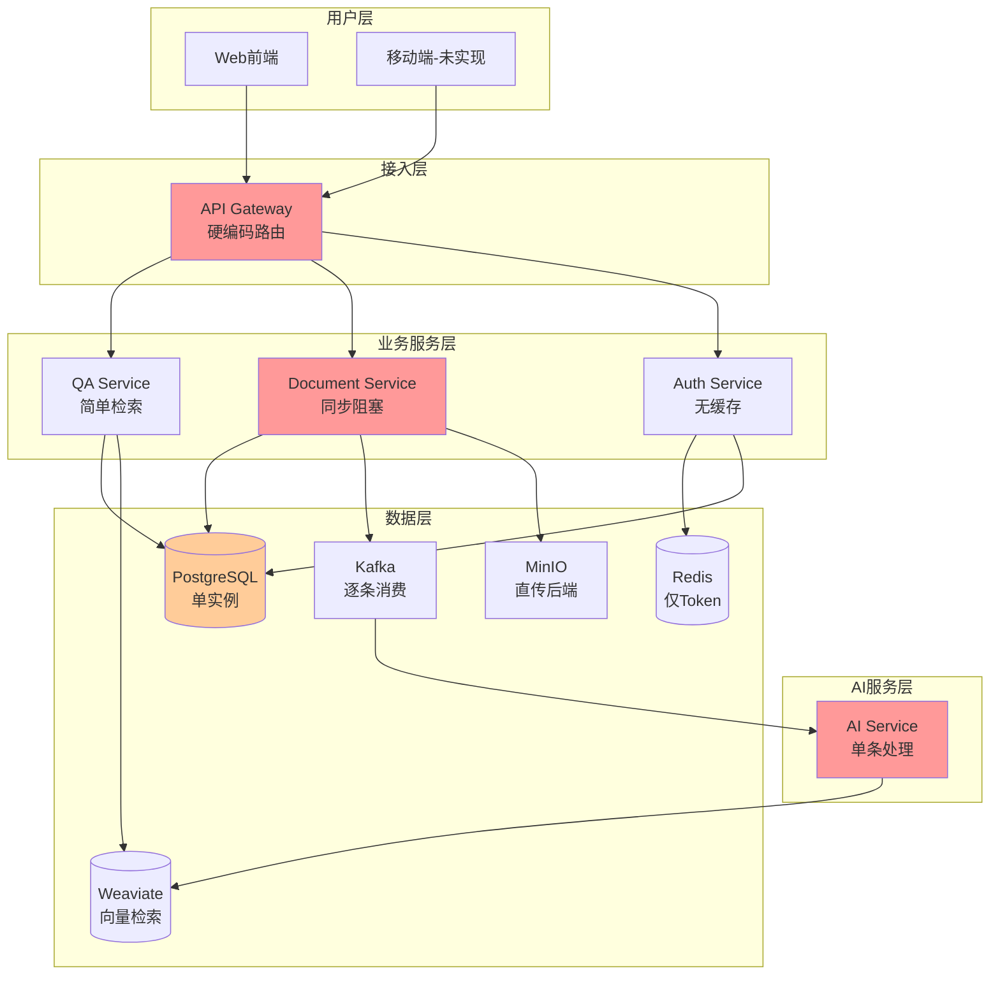
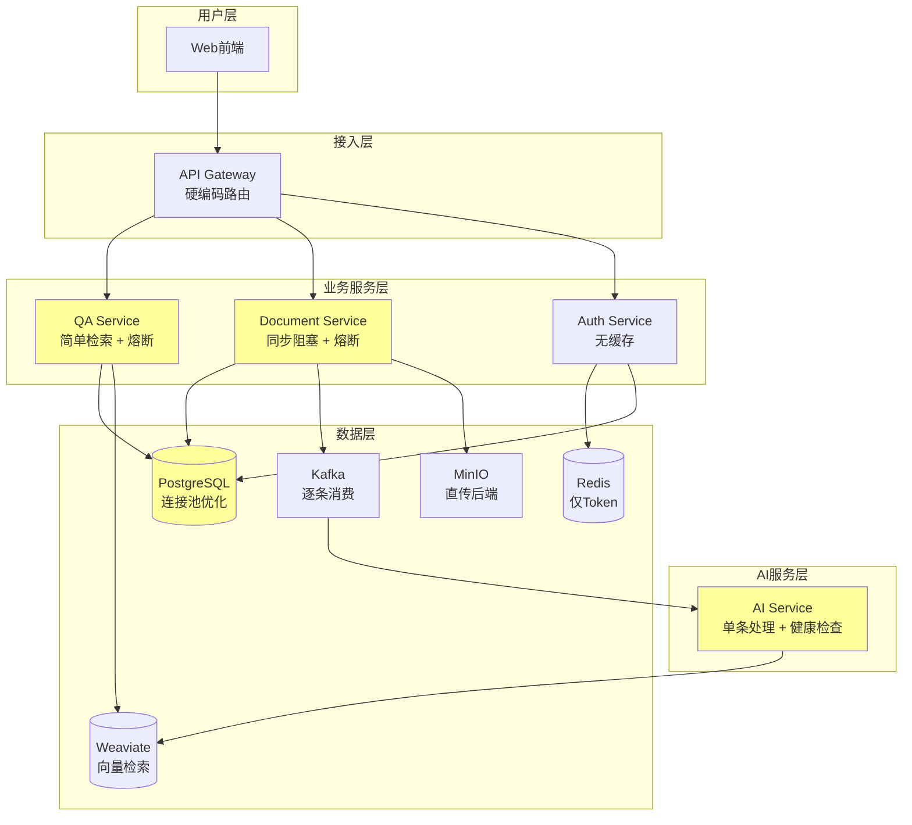
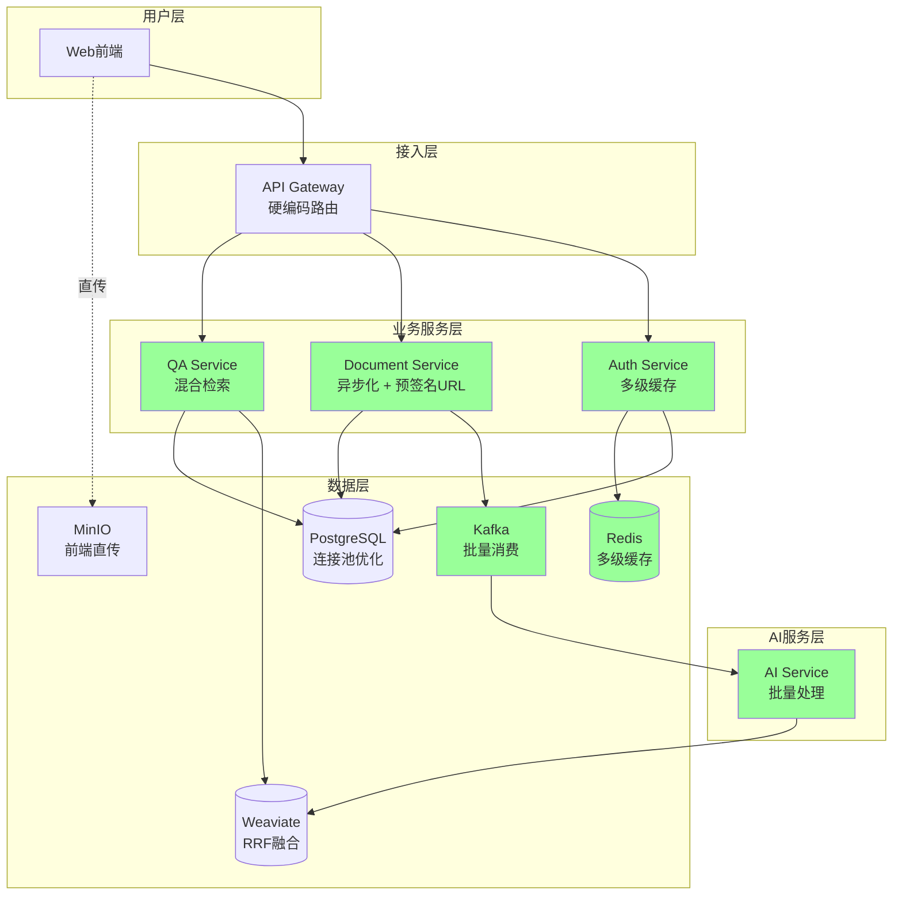
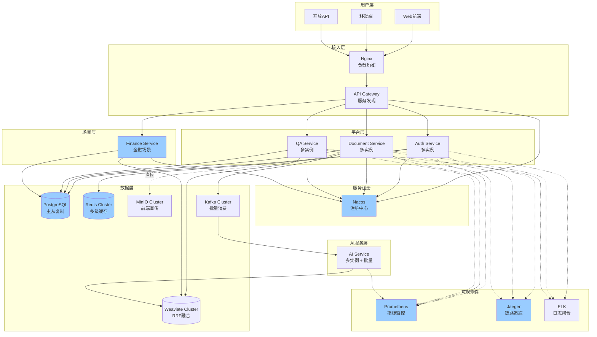
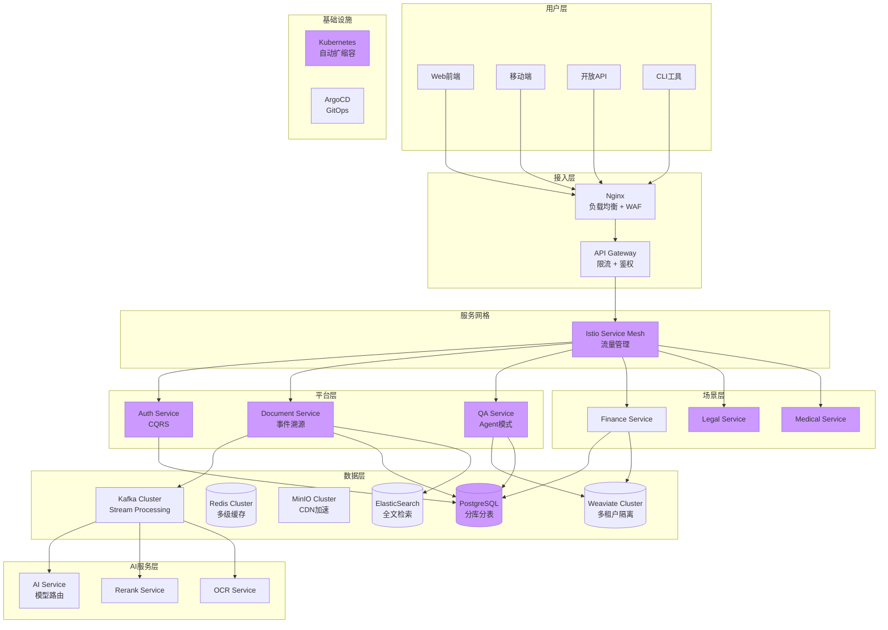

# gzDoc 架构演进路线图

## 📈 当前架构 vs 目标架构对比

### 当前架构 (MVP阶段)

**关键问题**:
- ❌ 网关硬编码路由,无法动态扩容
- ❌ 文档服务同步阻塞,并发能力差
- ❌ AI服务单条处理,吞吐量低
- ❌ 缺少熔断降级,存在雪崩风险
- ❌ 数据库单实例,存在单点故障

---

### Phase 1: 稳定性加固 (Week 1-2)

**改进点**:
- ✅ 添加Resilience4j熔断降级
- ✅ 配置HikariCP连接池
- ✅ 实现深度健康检查
- ✅ 完善异常处理机制

**性能提升**:
- 系统可用性: 95% → 99%
- 故障恢复时间: 5min → 1min

---

### Phase 2: 性能优化 (Week 3-4)

**改进点**:
- ✅ 文件直传MinIO (解除后端瓶颈)
- ✅ Caffeine + Redis多级缓存
- ✅ Kafka批量消费 (batch=100)
- ✅ 向量检索RRF融合 + Rerank

**性能提升**:
- 并发上传QPS: 10 → 1000 (+100倍)
- 问答P99延迟: 5s → 2s (-60%)
- 文档处理吞吐量: 10/s → 500/s (+50倍)
- 缓存命中率: 0% → 80%

---

### Phase 3: 架构完善 (Month 2)

**改进点**:
- ✅ 引入Nacos服务注册与发现
- ✅ 创建gzdoc-finance场景插件
- ✅ 集成Prometheus + Jaeger + ELK
- ✅ PostgreSQL主从复制
- ✅ Redis Cluster高可用

**性能提升**:
- 系统可用性: 99% → 99.9%
- 故障恢复时间: 1min → 10s
- 支持动态扩缩容
- 完整的可观测性

---

### Phase 4: 高级特性 (Month 3+)

**改进点**:
- ✅ CQRS + 事件溯源
- ✅ 数据库分库分表 (ShardingSphere)
- ✅ Service Mesh (Istio)
- ✅ Kubernetes自动扩缩容
- ✅ GitOps持续部署
- ✅ 多场景插件并行

**性能目标**:
- 并发上传QPS: 10000+
- 问答P99延迟: < 1s
- 文档处理吞吐量: 1000/s
- 系统可用性: 99.99%
- 支持亿级文档

---

## 📊 关键指标演进

### 性能指标

| 指标 | 当前 | Phase 1 | Phase 2 | Phase 3 | Phase 4 |
|------|------|---------|---------|---------|---------|
| **并发上传QPS** | 10 | 10 | 1,000 | 1,000 | 10,000 |
| **问答P99延迟** | 5s | 5s | 2s | 1.5s | 0.8s |
| **文档处理吞吐量** | 10/s | 10/s | 500/s | 500/s | 1,000/s |
| **缓存命中率** | 0% | 0% | 80% | 85% | 90% |
| **向量检索准确率** | 68% | 68% | 85% | 88% | 92% |

### 稳定性指标

| 指标 | 当前 | Phase 1 | Phase 2 | Phase 3 | Phase 4 |
|------|------|---------|---------|---------|---------|
| **系统可用性** | 95% | 99% | 99% | 99.9% | 99.99% |
| **故障恢复时间** | 5min | 1min | 1min | 10s | 5s |
| **MTBF(平均故障间隔)** | 7天 | 30天 | 30天 | 90天 | 180天 |
| **数据持久性** | 99.9% | 99.9% | 99.9% | 99.99% | 99.999% |

### 可扩展性指标

| 指标 | 当前 | Phase 1 | Phase 2 | Phase 3 | Phase 4 |
|------|------|---------|---------|---------|---------|
| **最大租户数** | 100 | 100 | 1,000 | 10,000 | 100,000 |
| **最大文档数** | 10万 | 10万 | 100万 | 1,000万 | 1亿 |
| **场景插件数** | 0 | 0 | 1 | 3 | 10+ |
| **服务实例数** | 1/服务 | 1/服务 | 3/服务 | 10/服务 | 50+/服务 |

---

## 🎯 技术债务清理计划

### 当前技术债务

1. **硬编码服务地址** (严重)
   - 影响: 无法动态扩容
   - 解决: Phase 3引入Nacos

2. **同步阻塞I/O** (严重)
   - 影响: 并发能力差
   - 解决: Phase 2实现异步化

3. **缺少熔断降级** (严重)
   - 影响: 雪崩风险
   - 解决: Phase 1集成Resilience4j

4. **贫血领域模型** (中等)
   - 影响: 代码可维护性差
   - 解决: Phase 3重构为DDD

5. **无API版本管理** (中等)
   - 影响: 升级困难
   - 解决: Phase 3添加版本前缀

6. **缺少分布式追踪** (轻微)
   - 影响: 故障定位慢
   - 解决: Phase 3集成Jaeger

---

## 💰 成本估算

### 基础设施成本 (月度)

| 资源 | 当前 | Phase 2 | Phase 3 | Phase 4 |
|------|------|---------|---------|---------|
| **服务器** | 1台 (8核16G) | 3台 (8核16G) | 5台 (16核32G) | 10台 (32核64G) |
| **成本** | ¥500 | ¥1,500 | ¥4,000 | ¥10,000 |
| **存储** | 100GB | 500GB | 2TB | 10TB |
| **成本** | ¥50 | ¥250 | ¥1,000 | ¥5,000 |
| **带宽** | 10Mbps | 50Mbps | 200Mbps | 1Gbps |
| **成本** | ¥100 | ¥500 | ¥2,000 | ¥10,000 |
| **总计** | ¥650 | ¥2,250 | ¥7,000 | ¥25,000 |

### 开发成本 (人天)

| 阶段 | 后端 | 前端 | AI | 测试 | 总计 |
|------|------|------|----|----|----|
| **Phase 1** | 5 | 0 | 1 | 1 | 7天 |
| **Phase 2** | 8 | 2 | 2 | 2 | 14天 |
| **Phase 3** | 12 | 3 | 2 | 3 | 20天 |
| **Phase 4** | 20 | 5 | 5 | 5 | 35天 |
| **总计** | 45天 | 10天 | 10天 | 11天 | 76天 |

---

## 🚀 实施建议

### 优先级排序

**P0 (立即执行)**:
1. 集成Resilience4j熔断降级
2. 配置HikariCP连接池
3. 实现深度健康检查

**P1 (本月完成)**:
4. 文件直传MinIO
5. 多级缓存
6. Kafka批量消费

**P2 (下月完成)**:
7. Nacos服务发现
8. DDD领域模型重构
9. Prometheus监控

**P3 (季度完成)**:
10. CQRS + 事件溯源
11. 数据库分库分表
12. Service Mesh

### 风险控制

1. **渐进式重构**: 不要一次性重写,逐步替换
2. **灰度发布**: 新功能先小流量验证
3. **回滚预案**: 每次变更准备回滚方案
4. **性能基线**: 变更前建立性能基线,变更后对比

---

## 📝 总结

gzDoc的架构演进需要遵循 **"稳定优先 → 性能优化 → 架构完善 → 高级特性"** 的路径。

**核心原则**:
1. **不要过早优化**: 先解决稳定性问题
2. **数据驱动决策**: 用监控数据指导优化方向
3. **小步快跑**: 每个Phase控制在2周内
4. **持续验证**: 每完成一个Phase进行压力测试

**成功标志**:
- ✅ Phase 1: 系统可用性达到99%
- ✅ Phase 2: 并发能力提升100倍
- ✅ Phase 3: 首个场景插件上线
- ✅ Phase 4: 支持亿级文档处理

记住:**架构不是一蹴而就的,而是演进而来的**。
