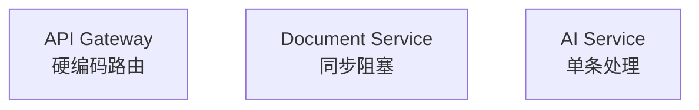

# gzDoc 架构审查文档索引

本目录包含对 gzDoc 项目的深入架构审查报告和改进方案。

---

## 📚 文档导航

### 🎯 快速开始

**如果你是第一次阅读架构审查报告,请按以下顺序阅读:**

1. **[架构审查总结](./ARCHITECTURE_REVIEW_SUMMARY.md)** ⭐ 推荐首读
   - 📖 阅读时间: 10分钟
   - 🎯 内容: 核心发现、改进建议优先级、风险评估
   - 👥 适合: 技术负责人、产品经理、开发团队

2. **[快速改进清单](./QUICK_IMPROVEMENT_CHECKLIST.md)** ⭐ 立即执行
   - 📖 阅读时间: 5分钟
   - 🎯 内容: Phase 1和Phase 2的详细实施步骤
   - 👥 适合: 开发团队

3. **[架构深度审查报告](./ARCHITECTURE_REVIEW.md)** 🔍 深入理解
   - 📖 阅读时间: 30分钟
   - 🎯 内容: 详细的问题分析、代码示例、技术方案
   - 👥 适合: 架构师、高级开发工程师

4. **[架构演进路线图](./ARCHITECTURE_EVOLUTION.md)** 🗺️ 长期规划
   - 📖 阅读时间: 15分钟
   - 🎯 内容: 4个阶段的演进路径、可视化架构图
   - 👥 适合: 技术负责人、架构师

---

## 📋 文档概览

### 1. ARCHITECTURE_REVIEW_SUMMARY.md

**核心内容**:
- ✅ 优势与问题分析
- 🎯 改进建议优先级 (P0/P1/P2)
- 📊 性能对比预测表
- 🚨 风险评估 (高/中/低)
- 💡 关键洞察和经验总结
- 📝 行动建议 (给不同角色)

**关键数据**:
```
当前状态:
- 并发上传QPS: 10
- 问答P99延迟: 5s
- 系统可用性: 95%

Phase 2后目标:
- 并发上传QPS: 1,000 (+100倍)
- 问答P99延迟: 2s (-60%)
- 系统可用性: 99% (+4%)
```

---

### 2. QUICK_IMPROVEMENT_CHECKLIST.md

**核心内容**:
- ✅ Phase 1: 紧急修复 (4个任务)
  - Task 1.1: 集成Resilience4j熔断降级
  - Task 1.2: 配置HikariCP连接池
  - Task 1.3: 实现深度健康检查
  - Task 1.4: 完善异常处理

- ✅ Phase 2: 性能优化 (3个任务)
  - Task 2.1: 实现文件直传MinIO
  - Task 2.2: 添加多级缓存
  - Task 2.3: Kafka批量消费

**每个任务包含**:
- 预计工时
- 详细实施步骤
- 代码示例
- 验收标准
- 验证命令

**进度跟踪表**:
| 任务 | 负责人 | 开始日期 | 预计完成 | 状态 |
|------|--------|---------|---------|------|
| Task 1.1 | | 2026-05-29 | 2026-05-30 | ⏳ |

---

### 3. ARCHITECTURE_REVIEW.md

**核心内容**:

#### 第1章: 高扩展性评估
- ✅ 做得好的地方: 模块化设计、技术栈选型
- ❌ 存在的问题: 
  - 场景层未实现
  - 缺少服务注册与发现
  - 数据库扩展性不足

#### 第2章: 高稳定性评估
- ❌ 严重问题:
  - 缺少熔断降级机制
  - 异常处理不完善
  - 缺少健康检查和优雅停机
  - 数据库连接池配置缺失

#### 第3章: 高并发能力评估
- ❌ 严重瓶颈:
  - 同步阻塞的文档处理
  - 缺少缓存策略
  - Kafka消费者缺少批量处理
  - 向量检索未优化

#### 第4章: 架构设计能力评估
- ⚠️ 设计不完整:
  - 缺少领域驱动设计(DDD)
  - 缺少API版本管理
  - 缺少事件溯源和CQRS
  - 缺少可观测性设计

**每节包含**:
- 现状分析
- 问题说明
- 改进方案 (含完整代码示例)
- 性能对比数据

---

### 4. ARCHITECTURE_EVOLUTION.md

**核心内容**:

#### 架构演进4阶段

**当前架构 (MVP阶段)**:


**Phase 1: 稳定性加固 (Week 1-2)**:
- 添加Resilience4j熔断降级
- 配置HikariCP连接池
- 实现深度健康检查

**Phase 2: 性能优化 (Week 3-4)**:
- 文件直传MinIO
- 多级缓存
- Kafka批量消费
- 向量检索RRF融合

**Phase 3: 架构完善 (Month 2)**:
- Nacos服务注册与发现
- DDD领域模型重构
- Prometheus + Jaeger监控
- 创建gzdoc-finance场景插件

**Phase 4: 高级特性 (Month 3+)**:
- CQRS + 事件溯源
- 数据库分库分表
- Service Mesh (Istio)
- Kubernetes自动扩缩容

#### 关键指标演进表

| 指标 | 当前 | Phase 1 | Phase 2 | Phase 3 | Phase 4 |
|------|------|---------|---------|---------|---------|
| 并发上传QPS | 10 | 10 | 1,000 | 1,000 | 10,000 |
| 系统可用性 | 95% | 99% | 99% | 99.9% | 99.99% |

#### 成本估算

**基础设施成本 (月度)**:
- 当前: ¥650/月
- Phase 2: ¥2,250/月
- Phase 3: ¥7,000/月
- Phase 4: ¥25,000/月

**开发成本 (人天)**:
- Phase 1: 7天
- Phase 2: 14天
- Phase 3: 20天
- Phase 4: 35天

---

## 🎯 如何使用这些文档

### 场景1: 我是技术负责人,需要了解整体情况

**阅读路径**:
1. 阅读 [ARCHITECTURE_REVIEW_SUMMARY.md](./ARCHITECTURE_REVIEW_SUMMARY.md) (10分钟)
2. 查看 [ARCHITECTURE_EVOLUTION.md](./ARCHITECTURE_EVOLUTION.md) 的演进路线图 (5分钟)
3. 根据优先级分配资源,启动Phase 1改进

**输出**:
- 改进计划时间表
- 资源分配方案
- 风险评估报告

---

### 场景2: 我是开发工程师,需要立即开始改进

**阅读路径**:
1. 打开 [QUICK_IMPROVEMENT_CHECKLIST.md](./QUICK_IMPROVEMENT_CHECKLIST.md)
2. 从Task 1.1开始,按步骤执行
3. 遇到技术细节时,查阅 [ARCHITECTURE_REVIEW.md](./ARCHITECTURE_REVIEW.md) 对应章节

**输出**:
- 完成的代码实现
- 通过的验收测试
- 更新的进度跟踪表

---

### 场景3: 我是架构师,需要深入理解问题

**阅读路径**:
1. 精读 [ARCHITECTURE_REVIEW.md](./ARCHITECTURE_REVIEW.md) (30分钟)
2. 对照代码库,验证问题分析
3. 参考改进方案,设计本地化实施方案

**输出**:
- 定制化改进方案
- 技术选型论证
- 架构决策记录(ADR)

---

### 场景4: 我是产品经理,需要了解影响

**阅读路径**:
1. 阅读 [ARCHITECTURE_REVIEW_SUMMARY.md](./ARCHITECTURE_REVIEW_SUMMARY.md) 的"行动建议"部分 (5分钟)
2. 查看性能对比预测表
3. 与技朧负责人讨论功能规划调整

**输出**:
- 更新的产品路线图
- 客户期望管理策略
- 市场推广计划

---

## 📊 关键数据速查

### 当前系统状态

| 维度 | 指标 | 数值 | 评级 |
|------|------|------|------|
| **扩展性** | 场景插件数 | 0 | ❌ |
| **稳定性** | 系统可用性 | 95% | ❌ |
| **并发性** | 上传QPS | 10 | ❌ |
| **架构完整性** | DDD/CQRS/监控 | 0% | ❌ |

### Phase 2目标状态

| 维度 | 指标 | 数值 | 评级 |
|------|------|------|------|
| **扩展性** | 场景插件数 | 1 | ✅ |
| **稳定性** | 系统可用性 | 99% | ✅ |
| **并发性** | 上传QPS | 1,000 | ✅ |
| **架构完整性** | DDD/CQRS/监控 | 60% | ⚠️ |

### 改进投入产出比

| 阶段 | 投入(人天) | 产出 | ROI |
|------|-----------|------|-----|
| Phase 1 | 7天 | 可用性95%→99% | ⭐⭐⭐⭐⭐ |
| Phase 2 | 14天 | QPS 10→1,000 | ⭐⭐⭐⭐⭐ |
| Phase 3 | 20天 | 首个场景上线 | ⭐⭐⭐⭐ |
| Phase 4 | 35天 | 支持亿级数据 | ⭐⭐⭐ |

---

## 🔗 相关文档链接

### 项目文档
- [架构设计文档](../architecture/README.md)
- [开发指南](../development/README.md)
- [部署文档](../deployment/README.md)
- [API文档](../api/README.md)

### 外部资源
- [Resilience4j官方文档](https://resilience4j.readme.io/)
- [Spring Cloud Gateway文档](https://spring.io/projects/spring-cloud-gateway)
- [Weaviate最佳实践](https://weaviate.io/developers/weaviate/concepts)
- [Kafka批量消费指南](https://kafka.apache.org/documentation/#consumerconfigs)

---

## 📞 反馈与支持

如果您在阅读或使用这些文档时遇到问题,欢迎:

1. **提交Issue**: 在GitHub仓库提交问题
2. **讨论区**: 在项目群中讨论
3. **邮件联系**: 发送架构相关问题至架构组邮箱

---

## 📝 文档维护

**最后更新**: 2026-05-29  
**维护者**: 架构组  
**更新频率**: 每个Phase完成后更新  
**下次更新**: Phase 1完成后 (预计2026-06-10)

---

## ✨ 结语

这套架构审查文档是 gzDoc 项目从"MVP原型"迈向"生产级系统"的重要指南。

**核心理念**:
> "先稳定,再性能,后扩展"

**行动口号**:
> "不要等待完美架构,从今天开始改进!"

祝改进顺利! 🚀
